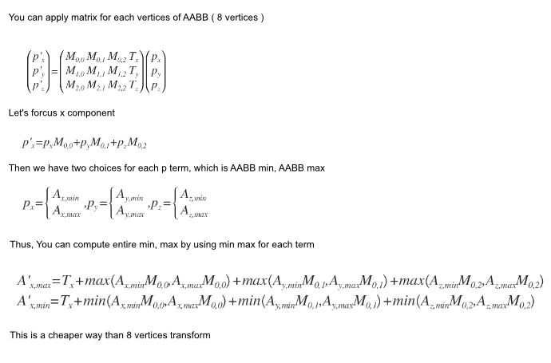
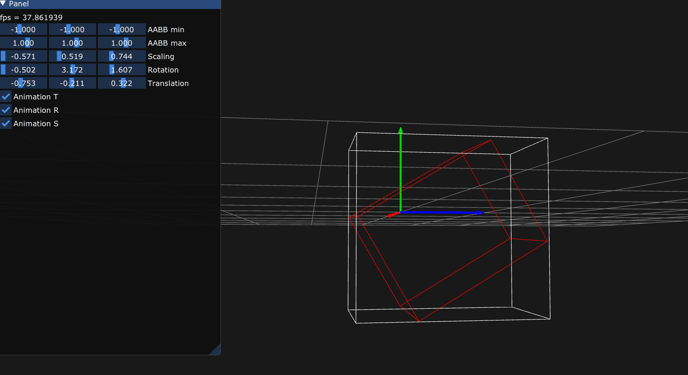

## Transform AABB by matrix

by graphics Gems X.8 TRANSFORMING AXIS-ALIGNED BOUNDING BOXES


### Build

```
premake5 vs2019
```
## core idea


<!-- 

\begin{pmatrix} p'_{ x } \\ p'_{ y } \\ p'_{ z } \end{pmatrix}=\begin{pmatrix} M_{ 0,0 } & M_{ 0,1 } & M_{ 0,2 } & T_{ x } \\ M_{ 1,0 } & M_{ 1,1 } & M_{ 1,2 } & T_{ y } \\ M_{ 2,0 } & M_{ 2,1 } & M_{ 2,2 } & T_{ z } \end{pmatrix}\begin{pmatrix} p_{ x } \\ p_{ y } \\ p_{ z } \end{pmatrix}\\ \\ p'_{ x }=p_{ x }M_{ 0,0 }+p_{ y }M_{ 0,1 }+p_{ z }M_{ 0,2 }\\ \\ p_{ x }=\begin{cases} A_{ x,min } \\ A_{ x,max } \end{cases},p_{ y }=\begin{cases} A_{ y,min } \\ A_{ y,max } \end{cases},p_{ z }=\begin{cases} A_{ z,min } \\ A_{ z,max } \end{cases}\\ \\ A'_{ x,max }=T_{ x }+max\left( A_{ x,min }M_{ 0,0 },A_{ x,max }M_{ 0,0 } \right) +max\left( A_{ y,min }M_{ 0,1 },A_{ y,max }M_{ 0,1 } \right) +max\left( A_{ z,min }M_{ 0,2 },A_{ z,max }M_{ 0,2 } \right) \\ A'_{ x,min }=T_{ x }+min\left( A_{ x,min }M_{ 0,0 },A_{ x,max }M_{ 0,0 } \right) +min\left( A_{ y,min }M_{ 0,1 },A_{ y,max }M_{ 0,1 } \right) +min\left( A_{ z,min }M_{ 0,2 },A_{ z,max }M_{ 0,2 } \right) 

 -->
## demo

